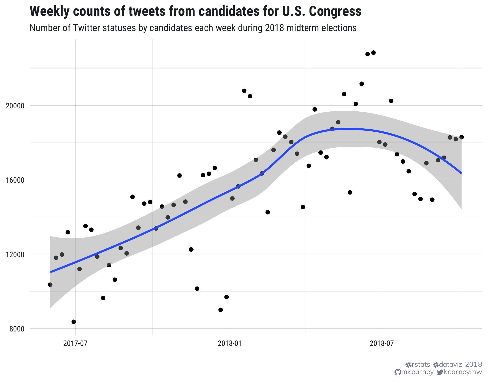

<!-- README.md is generated from README.Rmd. Please edit that file -->

```{r setup, include = FALSE}
knitr::opts_chunk$set(collapse = TRUE, comment = "#>", eval = FALSE)
library(mwk)
options(width = 100)
```
# congress_tweets

Collecting tweets posted by members of the United States Congress.

## Twitter data

Read and preview the data

```{r}
## read data
d <- readRDS("data/midterm-candidate-tweets.rds")

## number of observations
nrow(d)

## view time series
d %>% 
  filter(created_at > "2017-06-01") %>%
  rtweet::ts_plot("weeks", color = "transparent") + 
  geom_point() + 
  geom_smooth(method = "loess") + 
  theme_mwk() + 
  labs(x = NULL, y = NULL, title = "Weekly counts of tweets from candidates for U.S. Congress", 
    subtitle = "Number of Twitter statuses by candidates each week during 2018 midterm elections", 
    caption = theme_mwk_caption_text()) + 
  ggsave("tools/readme/time-series.png", width = 7, height = 5.5, units = "in")

## preview data
d %>%
  arrange(desc(created_at)) %>%
  select(created_at:text) %>%
  mutate(text = gsub("\n", " ", text)) %>%
  head(10)
```

<p style='align:center'></p>


View top-level data about members of congress (with corresponding `user_id` variable)

```{r}
## variable class information
cols <- cols(
  user_id = col_character(),
  govtrack = col_character(),
  title = col_character(),
  short_title = col_character(),
  first_name = col_character(),
  middle_name = col_character(),
  last_name = col_character(),
  suffix = col_character(),
  date_of_birth = col_date(format = ""),
  gender = col_character(),
  party = col_character(),
  state = col_character()
)
## read data
cng_toplevel <- readr::read_csv("data/congress-toplevel.csv", col_types = cols)

## preview first 10 rows
head(cng_toplevel, 10)
```

Compare sentiment of tweets before and after Nov 2016

<p style='align:center'></p>

View number of tweets collected per account

```{r}
## number of tweets collected per user
d %>% 
  group_by(screen_name) %>%
  summarise(n = n())
```


## Data sets

+ `data/candidates_2018_0921.csv`: **Pro Publica**'s *2018 Midterm Election Congressional Candidates*
   - **URL**: [propublica.org/datastore/dataset/2018-midterm-election-congressional-candidates](https://www.propublica.org/datastore/dataset/2018-midterm-election-congressional-candidates)
   - **Source**: Federal Election Commission, The Green Papers, Center for Responsive Politics, Google
   - **Date Released**: September 2018
   - **Description**: *A listing of active congressional candidates for the 2018 midterm elections, with some additional columns. The basis for this data is the Federal Election Commission’s candidate master file, and includes the columns described there. ProPublica has removed candidates no longer running in the general election, based on fundraising data and The Green Papers. ProPublica has added a `clean_name` column that converts the candidate name from all-capital letters and makes it more suitable for display, as well as a `url` column with the candidate's official website. In addition, we’ve added columns with the ID used by the Center for Responsive Politics and the ID used by Google’s Knowledge Graph Search, where available.*
```{r}
readr::read_csv("data/candidates_2018_0921.csv")
```
   
+ `dem_candidates.csv`: 
   - **URL**: [github.com/fivethirtyeight/data/tree/master/primary-candidates-2018](https://github.com/fivethirtyeight/data/tree/master/primary-candidates-2018)
   - **Description**: *contains information about the 811 candidates who have appeared on the ballot this year in Democratic primaries for Senate, House and governor, not counting races featuring a Democratic incumbent, as of August 7, 2018.*
```{r}
readr::read_csv(tfse::readlines("data/dem_candidates.csv"))
```

+ `rep_candidates.csv`: 
   - **URL**: [github.com/fivethirtyeight/data/tree/master/primary-candidates-2018](https://github.com/fivethirtyeight/data/tree/master/primary-candidates-2018)
   - **Description**: *contains information about the 774 candidates who have appeared on the ballot this year in Republican primaries for Senate, House and governor, not counting races featuring a Republican incumbent, through September 13, 2018.*


```{r}
readr::read_csv(tfse::readlines("data/rep_candidates.csv"))
```
