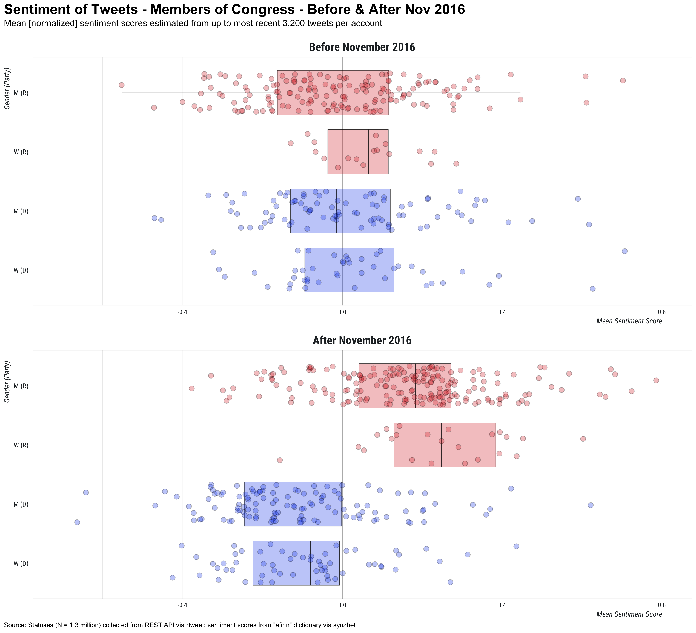

<!-- README.md is generated from README.Rmd. Please edit that file -->

```{r setup, include = FALSE}
knitr::opts_chunk$set(
  collapse = TRUE,
  comment = "#>"
)
library(dplyr)
source("R/dropbox-config.R")
options(width = 100)
library(readr)
cols <- cols(
  user_id = col_character(),
  govtrack = col_character(),
  title = col_character(),
  short_title = col_character(),
  first_name = col_character(),
  middle_name = col_character(),
  last_name = col_character(),
  suffix = col_character(),
  date_of_birth = col_date(format = ""),
  gender = col_character(),
  party = col_character(),
  state = col_character()
)
cng_toplevel <- readr::read_csv("data/congress-toplevel.csv", col_types = cols)
```
# congress_tweets

Collecting tweets posted by members of the United States Congress.

## Data

Data available in shared `congress_tweets` Dropbox folder

```{r, eval = FALSE}
##
link <- rdrop2::drop_share("congress_tweets")
link$url
```

Read and preview the data

```{r}
## read data
data <- readRDS("~/Dropbox/congress_tweets/tml.rds")

## preview data
data %>%
  arrange(desc(created_at)) %>%
  select(created_at:text) %>%
  mutate(text = gsub("\n", " ", text)) %>%
  head(10)
```

View top-level data about members of congress (with corresponding `user_id` variable)

```{r, eval = FALSE}
cng_toplevel <- readr::read_csv("data/congress-toplevel.csv")
head(cng_toplevel, 10)
```

```{r, echo = FALSE}
head(cng_toplevel, 10)
```

Compare sentiment of tweets before and after Nov 2016

<p style='align:center'></p>


View number of tweets collected per account

```{r}
## number of tweets collected per user
data %>% 
  group_by(screen_name) %>%
  summarise(n = n())
```
